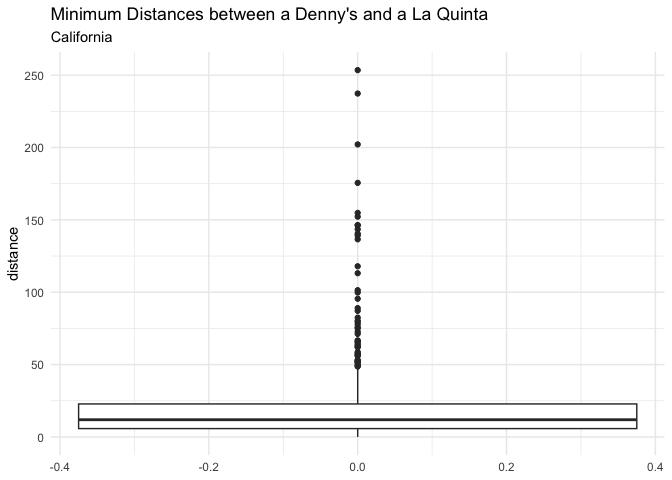

Lab 05 - Wrangling spatial data
================
Fiona Wang
Feb 19

### Load packages and data

``` r
library(tidyverse) 
library(dsbox) 
```

``` r
states <- read_csv("data/states.csv")
```

### Exercise 1

Filter both data frames and only select Alaska.

``` r
dn <- dennys
dn_ak <- dn %>% 
  filter(state == "AK")
nrow(dn_ak)
```

    ## [1] 3

There are 3 Denny’s locations in Alaska.

``` r
lq <- laquinta
lq_ak <- lq %>% 
  filter(state == "AK")
nrow(lq_ak)
```

    ## [1] 2

There are 2 La Quinta locations in Alaska.

### Exercise 2

We want to calculate how many pairs there are.

``` r
npairak <- nrow(dn_ak) * nrow(lq_ak)
npairak
```

    ## [1] 6

There are 6 pairings between Denny’s and La Quinta locations in Alaska.

### Exercise 3

Let’s join the two data frames.

``` r
dn_lq_ak <- full_join(dn_ak, lq_ak,
                      by = "state")
dn_lq_ak
```

    ## # A tibble: 6 × 11
    ##   address.x     city.x state zip.x longitude.x latitude.x address.y city.y zip.y
    ##   <chr>         <chr>  <chr> <chr>       <dbl>      <dbl> <chr>     <chr>  <chr>
    ## 1 2900 Denali   Ancho… AK    99503       -150.       61.2 3501 Min… "\nAn… 99503
    ## 2 2900 Denali   Ancho… AK    99503       -150.       61.2 4920 Dal… "\nFa… 99709
    ## 3 3850 Debarr … Ancho… AK    99508       -150.       61.2 3501 Min… "\nAn… 99503
    ## 4 3850 Debarr … Ancho… AK    99508       -150.       61.2 4920 Dal… "\nFa… 99709
    ## 5 1929 Airport… Fairb… AK    99701       -148.       64.8 3501 Min… "\nAn… 99503
    ## 6 1929 Airport… Fairb… AK    99701       -148.       64.8 4920 Dal… "\nFa… 99709
    ## # ℹ 2 more variables: longitude.y <dbl>, latitude.y <dbl>

### Exercise 4

We would like to know how many observations there are in this newly
joined data frame, as well as the names of the variables.

``` r
nrow(dn_lq_ak)
```

    ## [1] 6

``` r
names(dn_lq_ak)
```

    ##  [1] "address.x"   "city.x"      "state"       "zip.x"       "longitude.x"
    ##  [6] "latitude.x"  "address.y"   "city.y"      "zip.y"       "longitude.y"
    ## [11] "latitude.y"

As the two data frames have the same variables, the names have .x or .y
to help distinguish.

### Exercise 5

Haversine

``` r
haversine <- function(long1, lat1, long2, lat2, round = 3) {
  long1 <- long1 * pi / 180
  lat1 <- lat1 * pi / 180
  long2 <- long2 * pi / 180
  lat2 <- lat2 * pi / 180
  R <- 6371
  a <- sin((lat2 - lat1) / 2)^2 + cos(lat1) * cos(lat2) * sin((long2 - long1) / 2)^2
  d <- R * 2 * asin(sqrt(a))
  return(round(d, round))
}
```

### Exercise 6

Calculate the distance in each pair.

``` r
dn_lq_ak <- dn_lq_ak %>% 
  mutate(distance = haversine(
    longitude.x, latitude.x, longitude.y, latitude.y, round = 3
  ))
```

Interestingly, I looked up Google map to see if this calculation is
correct. However, the distance on google map is always less than what is
calculated here. I think it is because we are calculating the sphere, so
it’s larger.

### Exercise 7

Find the minimum distance between a Denny’s and La Quinta for each
Denny’s location.

``` r
dn_lq_ak_mindist <- dn_lq_ak %>% 
  group_by(address.x) %>% 
  summarize(closest = min(distance))
print(dn_lq_ak_mindist)
```

    ## # A tibble: 3 × 2
    ##   address.x        closest
    ##   <chr>              <dbl>
    ## 1 1929 Airport Way    5.20
    ## 2 2900 Denali         2.04
    ## 3 3850 Debarr Road    6.00

I realized that these distances are rounded to second.

### Exercise 8

Distribution of the distances (minimums)

``` r
summary(dn_lq_ak_mindist$closest)
```

    ##    Min. 1st Qu.  Median    Mean 3rd Qu.    Max. 
    ##   2.035   3.616   5.197   4.410   5.598   5.998

``` r
dn_lq_ak_mindist %>% 
  ggplot(aes(y = closest)) +
  geom_boxplot() +
  labs(title = "Minimum Distances between a Denny's and a La Quinta", 
       subtitle = "Alaska",
       x = NULL,
       y = "distance") +
  theme_minimal()
```

<!-- -->

There are only three distances in this data frame, so it’s hard to say
the distribution. According to the mean (4.41) and the median (5.20),
this is a slightly negatively skewed distribution. This makes sense
because there is a lower outlier (2.04). After running a boxplot, the
2.04 mi was not counted as an outlier.

### Exercise 9

What about North Carolina?  
First, how many Denny’s are there in NC?

``` r
dn_nc <- dn %>% 
  filter(state == "NC")
nrow(dn_nc)
```

    ## [1] 28

There are 28 Denny’s locations in North Carolina.  
Next, how many La Quinta are there in NC?

``` r
lq_nc <- lq %>% 
  filter(state == "NC")
nrow(lq_nc)
```

    ## [1] 12

There are 12 La Quintas in North Carolina. How many pairs are there for
us to calculate the distance?

``` r
npairnc <- nrow(dn_nc) * nrow(lq_nc)
npairnc
```

    ## [1] 336

We will get 336 distances data.  
Next, let’s join the two data frames for NC.

``` r
dn_lq_nc <- full_join(dn_nc, lq_nc,
                      by = "state")
dn_lq_nc
```

    ## # A tibble: 336 × 11
    ##    address.x    city.x state zip.x longitude.x latitude.x address.y city.y zip.y
    ##    <chr>        <chr>  <chr> <chr>       <dbl>      <dbl> <chr>     <chr>  <chr>
    ##  1 1 Regent Pa… Ashev… NC    28806       -82.6       35.6 165 Hwy … "\nBo… 28607
    ##  2 1 Regent Pa… Ashev… NC    28806       -82.6       35.6 3127 Slo… "\nCh… 28208
    ##  3 1 Regent Pa… Ashev… NC    28806       -82.6       35.6 4900 Sou… "\nCh… 28217
    ##  4 1 Regent Pa… Ashev… NC    28806       -82.6       35.6 4414 Dur… "\nDu… 27707
    ##  5 1 Regent Pa… Ashev… NC    28806       -82.6       35.6 1910 Wes… "\nDu… 27713
    ##  6 1 Regent Pa… Ashev… NC    28806       -82.6       35.6 1201 Lan… "\nGr… 27407
    ##  7 1 Regent Pa… Ashev… NC    28806       -82.6       35.6 1607 Fai… "\nCo… 28613
    ##  8 1 Regent Pa… Ashev… NC    28806       -82.6       35.6 191 Cres… "\nCa… 27518
    ##  9 1 Regent Pa… Ashev… NC    28806       -82.6       35.6 2211 Sum… "\nRa… 27612
    ## 10 1 Regent Pa… Ashev… NC    28806       -82.6       35.6 1001 Aer… "\nMo… 27560
    ## # ℹ 326 more rows
    ## # ℹ 2 more variables: longitude.y <dbl>, latitude.y <dbl>

``` r
nrow(dn_lq_nc)
```

    ## [1] 336

``` r
names(dn_lq_nc)
```

    ##  [1] "address.x"   "city.x"      "state"       "zip.x"       "longitude.x"
    ##  [6] "latitude.x"  "address.y"   "city.y"      "zip.y"       "longitude.y"
    ## [11] "latitude.y"

There are 336 observations, and the variable names are the same as what
we did for Alaska.  
Next, we will calculate the distance, using mutate to create a new
variable.

``` r
dn_lq_nc <- dn_lq_nc %>% 
  mutate(distance = haversine(
    longitude.x, latitude.x, longitude.y, latitude.y, round = 3
  ))
```

Calculate the minimum distance between Denny’s and La Quinta for each
Denny’s location.

``` r
dn_lq_nc_mindist <- dn_lq_nc %>% 
  group_by(address.x) %>% 
  summarize(closest = min(distance))
print(dn_lq_nc_mindist)
```

    ## # A tibble: 28 × 2
    ##    address.x                 closest
    ##    <chr>                       <dbl>
    ##  1 1 Regent Park Boulevard     108. 
    ##  2 101 Wintergreen Dr          120. 
    ##  3 103 Sedgehill Dr             26.7
    ##  4 1043 Jimmie Kerr Road        36.1
    ##  5 1201 S College Road         188. 
    ##  6 1209 Burkemount Avenue       39.1
    ##  7 1493 Us Hwy 74-A Bypass      70.1
    ##  8 1524 Dabney Dr               59.5
    ##  9 1550 Four Seasons           115. 
    ## 10 1800 Princeton-Kenly Road    55.9
    ## # ℹ 18 more rows

Next, describe the distribution and generate a graph.

``` r
summary(dn_lq_nc_mindist$closest)
```

    ##    Min. 1st Qu.  Median    Mean 3rd Qu.    Max. 
    ##   1.779  22.388  53.456  65.444  93.985 187.935

``` r
dn_lq_nc_mindist %>% 
  ggplot(aes(y = closest)) +
  geom_boxplot() +
  labs(title = "Minimum Distances between a Denny's and a La Quinta", 
       subtitle = "North Carolina",
       x = NULL,
       y = "distance") +
  theme_minimal()
```

<!-- -->

The min of this distribution is 1.78, which is really close. However,
the mean is 65.44, and the median is 53.46. The mean is really big,
meaning on average, the distance between Denny’s and La Quinta is pretty
far.

### Exercise 10

In this section, we are doing the same thing for Texas. I will not be
narrating as much.

``` r
dn_tx <- dn %>% 
  filter(state == "TX")
nrow(dn_tx)
```

    ## [1] 200

``` r
lq_tx <- lq %>% 
  filter(state == "TX")
nrow(lq_tx)
```

    ## [1] 237

``` r
npairtx <- nrow(dn_tx) * nrow(lq_tx)
npairtx
```

    ## [1] 47400

There 200 Denny’s locations, and 237 La Quinta locations in Texas. There
are 47400 pairs for us to calculate the distances, wow!

``` r
dn_lq_tx <- full_join(dn_tx, lq_tx,
                      by = "state")
dn_lq_tx
```

    ## # A tibble: 47,400 × 11
    ##    address.x    city.x state zip.x longitude.x latitude.x address.y city.y zip.y
    ##    <chr>        <chr>  <chr> <chr>       <dbl>      <dbl> <chr>     <chr>  <chr>
    ##  1 120 East I-… Abile… TX    79601       -99.6       32.4 3018 Cat… "\nAb… 79606
    ##  2 120 East I-… Abile… TX    79601       -99.6       32.4 3501 Wes… "\nAb… 79601
    ##  3 120 East I-… Abile… TX    79601       -99.6       32.4 14925 La… "\nAd… 75254
    ##  4 120 East I-… Abile… TX    79601       -99.6       32.4 909 East… "\nAl… 78516
    ##  5 120 East I-… Abile… TX    79601       -99.6       32.4 2400 Eas… "\nAl… 78332
    ##  6 120 East I-… Abile… TX    79601       -99.6       32.4 1220 Nor… "\nAl… 75013
    ##  7 120 East I-… Abile… TX    79601       -99.6       32.4 1165 Hwy… "\nAl… 76009
    ##  8 120 East I-… Abile… TX    79601       -99.6       32.4 880 Sout… "\nAl… 77511
    ##  9 120 East I-… Abile… TX    79601       -99.6       32.4 1708 Int… "\nAm… 79103
    ## 10 120 East I-… Abile… TX    79601       -99.6       32.4 9305 Eas… "\nAm… 79118
    ## # ℹ 47,390 more rows
    ## # ℹ 2 more variables: longitude.y <dbl>, latitude.y <dbl>

``` r
nrow(dn_lq_tx)
```

    ## [1] 47400

``` r
names(dn_lq_tx)
```

    ##  [1] "address.x"   "city.x"      "state"       "zip.x"       "longitude.x"
    ##  [6] "latitude.x"  "address.y"   "city.y"      "zip.y"       "longitude.y"
    ## [11] "latitude.y"

There are a total of 47400 observations!

``` r
dn_lq_tx <- dn_lq_tx %>% 
  mutate(distance = haversine(
    longitude.x, latitude.x, longitude.y, latitude.y, round = 3
  ))
dn_lq_tx_mindist <- dn_lq_tx %>% 
  group_by(address.x) %>% 
  summarize(closest = min(distance))
print(dn_lq_tx_mindist)
```

    ## # A tibble: 200 × 2
    ##    address.x             closest
    ##    <chr>                   <dbl>
    ##  1 100 Cottonwood         33.6  
    ##  2 100 E Pinehurst         1.39 
    ##  3 100 Us Highway 79 S    33.9  
    ##  4 101 N Fm 707           10.3  
    ##  5 1011 Beltway Parkway   14.0  
    ##  6 1015 Spur 350 West      1.74 
    ##  7 1015 West Main St       1.10 
    ##  8 10367 Highway 59       37.6  
    ##  9 10433 N Central Expwy   0.618
    ## 10 105 W 42nd St           6.88 
    ## # ℹ 190 more rows

``` r
summary(dn_lq_tx_mindist$closest)
```

    ##    Min. 1st Qu.  Median    Mean 3rd Qu.    Max. 
    ##  0.0160  0.7305  3.3715  5.7918  6.6303 60.5820

``` r
dn_lq_tx_mindist %>% 
  ggplot(aes(y = closest)) +
  geom_boxplot() +
  labs(title = "Minimum Distances between a Denny's and a La Quinta", 
       subtitle = "Texas",
       x = NULL,
       y = "distance") +
  theme_minimal()
```

<!-- -->

The minimum is 0.016, that’s really close to each other! The mean is
5.79. For a 200-observation data frame, this is unbelievable. This means
that in Texas, Denny’s and La Quinta tends to be very close to each
other in general. From the boxplot, we do see a couple outliers at the
higher end.

### Exercise 11

The state I am interested in is California. More codes and less
narrating.

``` r
dn_ca <- dn %>% 
  filter(state == "CA")
nrow(dn_ca)
```

    ## [1] 403

``` r
lq_ca <- lq %>% 
  filter(state == "CA")
nrow(lq_ca)
```

    ## [1] 56

``` r
npairca <- nrow(dn_ca) * nrow(lq_ca)
npairca
```

    ## [1] 22568

There are 403 Denny’s locations and 56 La Quinta locations in
California. That gives us 22568 pairs to calculate distances.

``` r
dn_lq_ca <- full_join(dn_ca, lq_ca,
                      by = "state")
```

    ## Warning in full_join(dn_ca, lq_ca, by = "state"): Detected an unexpected many-to-many relationship between `x` and `y`.
    ## ℹ Row 1 of `x` matches multiple rows in `y`.
    ## ℹ Row 1 of `y` matches multiple rows in `x`.
    ## ℹ If a many-to-many relationship is expected, set `relationship =
    ##   "many-to-many"` to silence this warning.

``` r
dn_lq_ca
```

    ## # A tibble: 22,568 × 11
    ##    address.x    city.x state zip.x longitude.x latitude.x address.y city.y zip.y
    ##    <chr>        <chr>  <chr> <chr>       <dbl>      <dbl> <chr>     <chr>  <chr>
    ##  1 14240 Us Hi… Adela… CA    92301       -117.       34.5 1752 Cle… "\nAn… 92802
    ##  2 14240 Us Hi… Adela… CA    92301       -117.       34.5 8858 Spe… "\nBa… 93308
    ##  3 14240 Us Hi… Adela… CA    92301       -117.       34.5 3232 Riv… "\nBa… 93308
    ##  4 14240 Us Hi… Adela… CA    92301       -117.       34.5 920 Univ… "\nBe… 94710
    ##  5 14240 Us Hi… Adela… CA    92301       -117.       34.5 3 Center… "\nLa… 90623
    ##  6 14240 Us Hi… Adela… CA    92301       -117.       34.5 1771 Res… "\nDa… 95618
    ##  7 14240 Us Hi… Adela… CA    92301       -117.       34.5 6275 Dub… "\nDu… 94568
    ##  8 14240 Us Hi… Adela… CA    92301       -117.       34.5 316 Pitt… "\nFa… 94534
    ##  9 14240 Us Hi… Adela… CA    92301       -117.       34.5 190 N. 1… "\nFo… 93625
    ## 10 14240 Us Hi… Adela… CA    92301       -117.       34.5 46200 La… "\nFr… 94538
    ## # ℹ 22,558 more rows
    ## # ℹ 2 more variables: longitude.y <dbl>, latitude.y <dbl>

``` r
nrow(dn_lq_ca)
```

    ## [1] 22568

``` r
names(dn_lq_ca)
```

    ##  [1] "address.x"   "city.x"      "state"       "zip.x"       "longitude.x"
    ##  [6] "latitude.x"  "address.y"   "city.y"      "zip.y"       "longitude.y"
    ## [11] "latitude.y"

``` r
# 22568 observations

dn_lq_ca <- dn_lq_ca %>% 
  mutate(distance = haversine(
    longitude.x, latitude.x, longitude.y, latitude.y, round = 3
  ))
dn_lq_ca_mindist <- dn_lq_ca %>% 
  group_by(address.x) %>% 
  summarize(closest = min(distance))
print(dn_lq_ca_mindist)
```

    ## # A tibble: 403 × 2
    ##    address.x            closest
    ##    <chr>                  <dbl>
    ##  1 #2 Serra Monte         6.24 
    ##  2 10 Airport Blvd        0.093
    ##  3 1000 Imola Ave        14.5  
    ##  4 1000 W Steele Lane    58.7  
    ##  5 1001 E Capitol        13.5  
    ##  6 1010 W Alameda Ave    24.8  
    ##  7 1011 Riley Street     11.4  
    ##  8 1014 N Main St       137.   
    ##  9 1015 Blossom Hill Rd  15.4  
    ## 10 1019 East Main St     80.3  
    ## # ℹ 393 more rows

``` r
summary(dn_lq_ca_mindist$closest)
```

    ##    Min. 1st Qu.  Median    Mean 3rd Qu.    Max. 
    ##   0.016   5.767  11.897  22.083  22.796 253.462

``` r
dn_lq_ca_mindist %>% 
  ggplot(aes(y = closest)) +
  geom_boxplot() +
  labs(title = "Minimum Distances between a Denny's and a La Quinta", 
       subtitle = "California",
       x = NULL,
       y = "distance") +
  theme_minimal()
```

<!-- -->

The minimum is 0.016, quite similar to that of Texas. The mean is 22.08,
with a lot of outliers at the higher end. On average, the distance
between Denny’s and La Quinta is not that close to each other.

### Exercise 12

In this exercise, we compared four states: Alaska, North Carolina,
Texas, and California. I would say that Mitch Hedberg’s joke holds true
for Alaska. The reasoning is that we examined three distances for
Alaska, and all of them are no further than 6 mi. This shows that this
joke applies to all instances. For other states, even though they might
have similar mean scores, the variance is much larger. The extent to
which this joke applies to the four states, I gave them a ranking:
Alaska \> Texas \> California \> North Carolina.

Thanks for reading.
